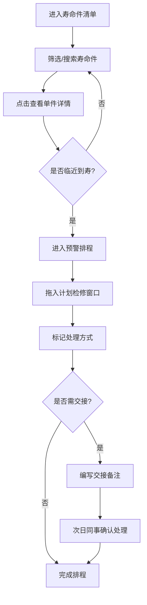

## 1. 产品概述

面向航空公司航材计划员的寿命件追踪台账系统，核心覆盖发动机 LLP（Life Limited Parts）、起落架大修件、应急设备等带寿命限制的航材。系统提供寿命件全生命周期可视化追踪、智能预警排程和班次交接备注三大核心能力，确保每一件寿命件从装机到到寿的全过程可查、可控、可交接，杜绝寿命临界件无人接手的安全隐患。

- 目标用户：航空公司航材计划员（白班/夜班轮值）
- 核心价值：降低寿命件超期风险，提升排程效率，消除班次交接盲区

## 2. 核心功能

### 2.1 用户角色

| 角色 | 说明 | 核心权限 |
|------|------|----------|
| 航材计划员 | 轮值制度（白班/夜班） | 查看寿命件、筛选搜索、预警排程、拖拽排期、标记状态、编写交接备注 |
| 计划主管 | 管理层 | 全部计划员权限 + 审核交接备注、查看全局预警统计 |

### 2.2 功能模块

1. **寿命件清单页**：筛选栏、寿命件表格、单件详情抽屉
2. **预警排程页**：风险等级列表、排程拖拽区、状态标记工具栏
3. **交接备注功能**：嵌入寿命件详情与排程中的备注模块，含处理状态流转

### 2.3 页面详情

| 页面名称 | 模块名称 | 功能描述 |
|----------|----------|----------|
| 寿命件清单 | 筛选栏 | 按件号、序号、装机飞机、剩余循环、日历寿命多维筛选；支持快速预设（30/60/90天内到期） |
| 寿命件清单 | 寿命件表格 | 展示件号、序号、件名、装机飞机、剩余循环、日历到期日、状态标签；支持排序和分页 |
| 寿命件清单 | 单件详情抽屉 | 点击行展开右侧抽屉：当前装机位置、上次拆装记录、适航文件依据、预计到寿日期、交接备注历史 |
| 预警排程 | 风险列表 | 按未来30/60/90天或指定飞行循环生成风险列表，红/橙/黄三级预警色 |
| 预警排程 | 排程拖拽区 | 拖拽寿命件到计划检修窗口时间轴，可视化管理排期 |
| 预警排程 | 状态标记 | 标记为：需订件/需送修/可与定检合并，带颜色标签 |
| 预警排程 | 交接备注面板 | 嵌入式备注编辑区，夜班计划员可写明判断原因和待确认事项 |
| 交接备注 | 备注编辑 | 支持富文本（原因、待确认事项、处理建议），关联具体寿命件 |
| 交接备注 | 状态流转 | 待确认→已确认→已处理，带操作人和时间戳 |
| 交接备注 | 未读提醒 | 顶部导航显示未处理交接备注数量徽标 |

## 3. 核心流程

1. 计划员进入寿命件清单，通过筛选快速定位关注件
2. 点击单件查看详情（装机位置、拆装记录、适航依据、到寿日期）
3. 切换到预警排程，查看风险列表中临近到寿件
4. 将临寿件拖入计划检修窗口，标记处理方式（订件/送修/合并定检）
5. 夜班计划员在交接备注中写明判断原因和待确认事项
6. 次日白班计划员看到未处理备注，确认后更新状态

## 4. 用户界面设计

### 4.1 设计风格

- **主色调**：深灰蓝底色（#0F1923）配合琥珀色（#F59E0B）强调色，辅以青色（#06B6D4）信息色，营造航空驾驶舱仪表盘质感
- **按钮风格**：圆角矩形，微弱3D凸起效果，琥珀色主操作、灰色次要操作
- **字体**：显示字体使用 JetBrains Mono（数据密集型界面），正文使用 Noto Sans SC
- **布局风格**：左侧导航 + 右侧内容区，数据表格为主、卡片为辅
- **图标风格**：线性图标（Lucide），配合状态色指示灯

### 4.2 页面设计概览

| 页面名称 | 模块名称 | UI元素 |
|----------|----------|--------|
| 寿命件清单 | 筛选栏 | 水平排列输入框和下拉选择器，带快速预设按钮（30天/60天/90天），暗色背景 |
| 寿命件清单 | 寿命件表格 | 深色表头，斑马纹行，状态标签带颜色圆点，行悬停高亮，点击展开右侧抽屉 |
| 寿命件清单 | 单件详情抽屉 | 右侧滑出抽屉，分区展示装机信息、拆装记录时间线、适航文件列表、到寿倒计时 |
| 预警排程 | 风险列表 | 左侧面板，按风险等级分组（红/橙/黄），卡片式列表，拖拽手柄 |
| 预警排程 | 排程时间轴 | 右侧主区域，甘特图风格时间轴，拖放目标区域，标注检修窗口 |
| 预警排程 | 状态标记 | 卡片上的标签按钮，点击切换：订件(蓝)/送修(橙)/合并定检(绿) |
| 预警排程 | 交接备注面板 | 排程区下方的可展开面板，消息气泡式展示，带未读红点 |
| 全局 | 顶部导航 | 应用名 + 页面标签切换 + 未处理备注徽标 + 当前班次指示 |

### 4.3 响应式

- 桌面优先设计（1920×1080 主目标分辨率）
- 1280px 以下自适应简化布局（抽屉改为全屏弹窗）
- 触控优化：拖拽操作支持鼠标和触控

### 4.4 3D 场景指引

- 不适用
