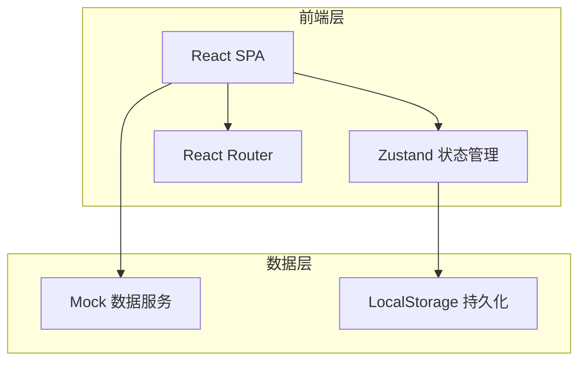
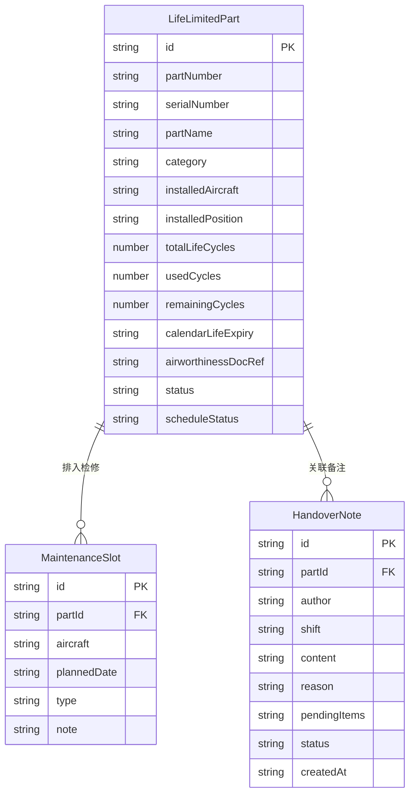

## 1. 架构设计



纯前端架构，使用 Mock 数据模拟后端，LocalStorage 做数据持久化，确保演示完整性。

## 2. 技术说明

- **前端**：React@18 + TypeScript + Tailwind CSS@3 + Vite
- **初始化工具**：vite-init (react-ts 模板)
- **后端**：无（纯前端，Mock 数据）
- **数据库**：无（LocalStorage 持久化 + 内存 Mock 数据）
- **状态管理**：Zustand
- **路由**：React Router DOM v6
- **拖拽**：@dnd-kit/core + @dnd-kit/sortable
- **图标**：lucide-react
- **日期处理**：date-fns

## 3. 路由定义

| 路由 | 用途 |
|------|------|
| `/` | 重定向到寿命件清单 |
| `/parts` | 寿命件清单页：筛选、列表、详情抽屉 |
| `/schedule` | 预警排程页：风险列表、拖拽排程、状态标记、交接备注 |

## 4. API 定义

无后端 API，使用 Zustand Store + Mock 数据直接在内存中操作。

### 数据接口定义

```typescript
interface LifeLimitedPart {
  id: string
  partNumber: string
  serialNumber: string
  partName: string
  category: 'engine_llp' | 'landing_gear' | 'emergency_equip'
  installedAircraft: string
  installedPosition: string
  totalLifeCycles: number
  usedCycles: number
  remainingCycles: number
  calendarLifeExpiry: string
  manufacturingDate: string
  lastRemovalDate: string | null
  lastInstallDate: string
  airworthinessDocRef: string
  status: 'normal' | 'warning' | 'critical' | 'expired'
  scheduleStatus: 'none' | 'need_order' | 'need_repair' | 'merge_check'
}

interface MaintenanceSlot {
  id: string
  partId: string
  aircraft: string
  plannedDate: string
  type: 'order' | 'repair' | 'merge_check'
  note: string
}

interface HandoverNote {
  id: string
  partId: string
  author: string
  shift: 'day' | 'night'
  content: string
  reason: string
  pendingItems: string
  status: 'pending' | 'confirmed' | 'resolved'
  createdAt: string
  confirmedBy: string | null
  confirmedAt: string | null
  resolvedBy: string | null
  resolvedAt: string | null
}
```

## 5. 服务端架构图

不适用（纯前端项目）

## 6. 数据模型

### 6.1 数据模型定义



### 6.2 数据定义语言

使用 TypeScript 接口定义，Mock 数据在 `src/data/mockData.ts` 中初始化，包含约 20 条寿命件样例数据，覆盖发动机 LLP、起落架大修件、应急设备三类。
